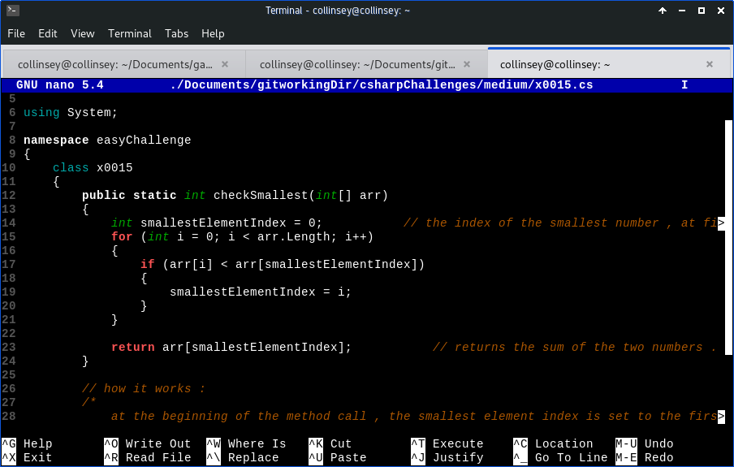

# About : 
Nano editor reads this cs.nanorc theme file and parses them as visual themes while working in nano.
Use this if you want fancy colors for your csharp source files in nano.

# How to use : 
1. Copy the cs.nanorc file to the nano config directory in your computer.

In unix-like systems , copy to : **/usr/share/nano/** .

2. Restart nano for changes to take effect.

# Screenshots : 

